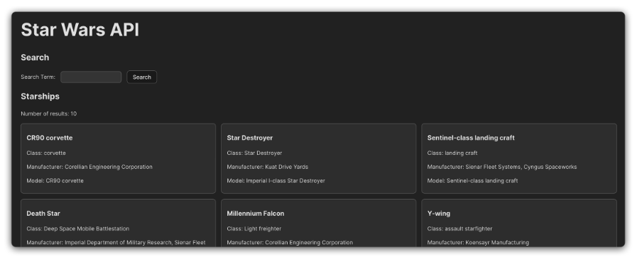

# Fetching Data in React Lab Exercise - Star Wars API
In this lab, we’ll create an application that fetches and displays data from the Star Wars API (SWAPI). You’ll develop a feature that presents a list of starships and allows users to search for specific starships by name.

**Finished API Example**

**Component hierarchy diagram**

**Above is a component hierarchy diagram to help understand the structure of the application.**

**During this exercise, you will practice making an API call and dynamically updating the DOM in React.**

## Below, is a brief description of the role of each component in your app
**App, StarshipSearch, StarshipList, StarshipCard:**

- App: The root component that orchestrates the entire application.
- StarshipSearch: Allows users to submit a search form for the name of a starship.
- StarshipList: Displays a list of starships held in state.
- StarshipCard: A component used within StarshipList that displays information on a single starship.

# User stories
**Use the following user stories as a guide as you build each feature:**

- As a user, I should see a list of starships when the site loads. This should be displayed as a card for each starship.

- As a user, I should see the name, starship_class, manufacturer, and model data for a starship in each card.

- As a user, I should see a search bar above the list of starships. I should be able to enter a starship’s name (or a portion of the name) into the search bar and submit my query. When the query is submitted, the input should be reset so I can easily enter my next query.

- As a user, when I submit a search, the starship results shown should update based on my query. My query should not be case sensitive and also return partial name matches.

- As a user, I should see some search metadata above the search form. This search data should include: 
(a) The number of results currently shown. This should always be displayed, even if I haven’t conducted a search. 
(b) My last search query, if I have made one. If I have not conducted a search or the search results have been reset, the text “Search for a starship by name.” should be shown instead. 

- As a user, I should be able to reset the search by clicking a button labeled Show all starships. This button should only be shown if I have applied a search filter. This button should effectively clear my last search query.

# Lab exercise
- Your goal is to implement the user stories listed above. Follow the steps below to help you accomplish this:

1. Research the documentation of SWAPI to find the endpoint for the starships resource. Figuring out documentation is a critical skill for a developer, so devote 10-15 minutes just to looking through everything. You may not understand it all, but you should learn a bit in the process.

- The individual resource pages allow you to see the result of a call before you integrate the API into your application.

- 👤 The following steps correspond to these user stories:

- As a user, I should see a list of starships when the site loads. This should be displayed as a card for each starship.

- As a user, I should see the name, starship_class, manufacturer, and model data for a starship in each card.

2. Create a src/services/starshipService.js service module and ensure you make all API/fetch calls from this module. Use named exports to expose AJAX functionality as needed, for example, export { index } to obtain all starships.

3. Create a service function to retrieve a list of starships.

- To handle data fetching effectively, incorporate error handling in your service functions. Wrap your fetch calls in try-catch blocks to manage scenarios where the API returns an error.

- 🚀 Note that responses with status codes in the 400/500 range (which will not include valid data) are not considered errors by the try block. You may consider including some code like the block below to handle these errors more gracefully.

- Sample Code Below:
if (!res.ok) {
  // Throw an error if we get a response that doesn't 
  // hold valid starship data.
  throw new Error('Failed to fetch starships.');
}

- This code should go between the fetch() call and the return statement in your service function.

4. **Create each of the components listed below.**

- **src/components/StarshipSearch/StarshipSearch.jsx**
- **src/components/StarshipList/StarshipList.jsx**
- **src/components/StarshipCard/StarshipCard.jsx**

5. Import StarshipSearch and StarshipList at the top of App.jsx. Import the StarshipCard component in StarshipList.jsx. You’ll use the StarshipCard when mapping through props.starships in the StarshipList component.

6. Import useState in App, and create a new state variable called starshipsData. Set its initial state to an empty array ([]). Create another state variable called displayedStarships. Also, set its initial state to an empty array.

- 💡 Why have two state variables related to starships? The starshipsData state should always hold all the starship data after retrieving it. The displayedStarships state is what users will actually see on the page - this state will change when a user conducts a search.

- This pattern keeps us from having to call the API to retrieve all the starship data every time we want to conduct a new search.

- This is an appropriate implementation since this API doesn’t have search functionality, and the initial data won’t go stale. Note that this is not appropriate for all apps! It just happens to work well here.

7. Import useEffect in App. Use this to call your service function when the page loads. Set the retrieved data to both the starshipsData and displayedStarships state.

8. Display the starship results! Refer to the user stories to determine the implementation details for this step. At the end of this step, your StarshipList and StarshipCard components should be complete. Do not attempt to implement search functionality before you have these finalized.

- 💡 Because data from the API is loaded asynchronously, there are times when the data may not be available to render. In this case, you may want to display a “Loading…” message instead.

9. Time to implement the search feature!

- 👤 This step will implement this user story:

- As a user, I should see a search bar above the list of starships. I should be able to enter a starship’s name (or a portion of the name) into the search bar and submit my query. When the query is submitted, the input should be reset so I can easily enter my next query.

- Start by creating the form itself. You should only need a single controlled input and a submit button. When the user selects the submit button, a handleSubmit function should be called. This function will:

- Call a new search function in the App component. You’ll need to write this function and pass it on props to this component. Pass the search input’s state to it as an argument. We’ll return to this in the next step.
- Save the search input’s current state into a new state variable in the StarshipSearch component called prevSearchTerm. We’re doing this to lay the groundwork for completing one of our future user stories (users can see what they just searched for).
- Reset the search input’s state to an empty string ('') so the user can search for another name without clearing the input themselves.

10. You’re almost done with the search functionality; the rest of the work is in the App component.

- 👤 This step will implement this user story:

- As a user, when I submit a search, the starship results shown should update based on my query. My query should not be case sensitive and also return partial name matches.

- Return to the App component and write a function to search for a starship. This function should:

- Filter the starshipsData state based on the name of a starship.
- The user’s query should be matched against the entirety of a starship’s name. For example, if the user searches for Falcon, they should see the Millennium Falcon included in the results.
- The user’s query should not be case-sensitive. For example, if users search for fAlCoN, they should see the Millennium Falcon included in the results.
- Use the result of the filter to set the displayedStarships state. Do not modify the starshipsData state.

- At the end of this step, you should be able to conduct a search and see all the starships that match the search you made.

11. It’s just detail work from here!

- 👤 This step will implement this user story:

- As a user, I should see some search metadata above the search form. This search data should include:

The number of results currently shown. This should always be displayed, even if I haven’t conducted a search.
My last search query, if I have made one. If I have not conducted a search or the search results have been reset, the text “Search for a starship by name.” should be shown instead.
Use props to pass the number of displayed starships to the StarshipSearch component from the App component. Display this data above the search form.

Use the state variable you created in step 9 (prevSearchTerm) to display the previous search query to the user. If the user has not conducted a search, display the text "Search for a starship by name." instead.

12. You’ve made it, it’s the last step!

- 👤 This step will implement this user story:

- As a user, I should be able to reset the search by clicking a button labeled Show all starships. This button should only be shown if I have applied a search filter. This button should effectively clear my last search query.

- You’ve got this! Think through what you’ll need and what tools you already have to accomplish this last user story.

- 💡 Hint: What happens if you filter the starship state using an empty string?

# Level Up
Here’s some ideas to take this to the next level:

1. Open up the search to go beyond a starship’s name. Include other data points like the model, manufacturer, and starship class.

2. Pick another resource from the ones listed on SWAPI’s landing page, such as People, Species, Planets, etc. Build a user interface implementing the same functionality as starships.

3. Add some styling to enhance the user experience of your application.

# React + Vite

This template provides a minimal setup to get React working in Vite with HMR and some ESLint rules.

Currently, two official plugins are available:

- [@vitejs/plugin-react](https://github.com/vitejs/vite-plugin-react/blob/main/packages/plugin-react) uses [Babel](https://babeljs.io/) for Fast Refresh
- [@vitejs/plugin-react-swc](https://github.com/vitejs/vite-plugin-react/blob/main/packages/plugin-react-swc) uses [SWC](https://swc.rs/) for Fast Refresh

## Expanding the ESLint configuration

If you are developing a production application, we recommend using TypeScript with type-aware lint rules enabled. Check out the [TS template](https://github.com/vitejs/vite/tree/main/packages/create-vite/template-react-ts) for information on how to integrate TypeScript and [`typescript-eslint`](https://typescript-eslint.io) in your project.

